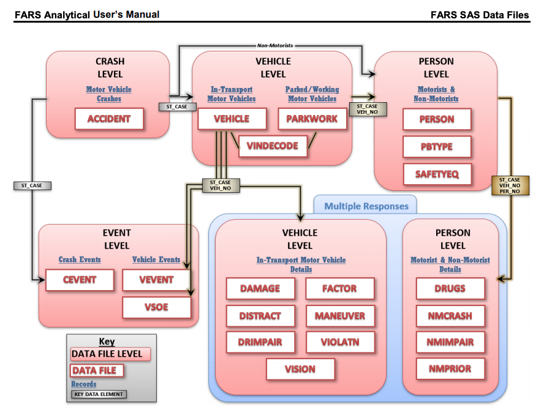
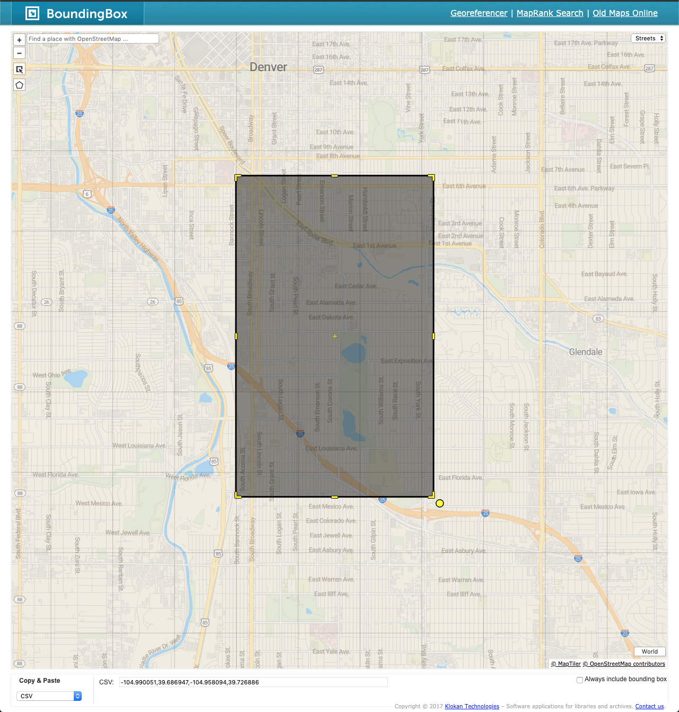
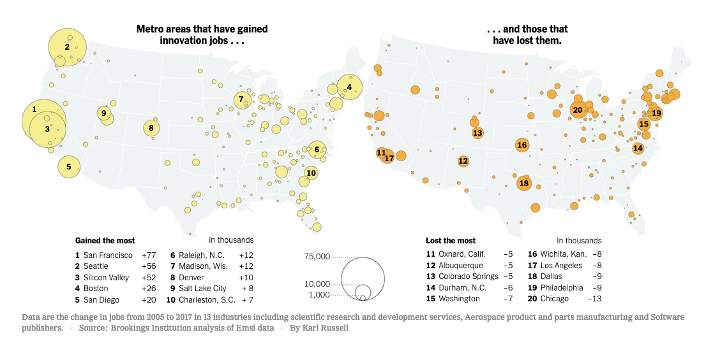
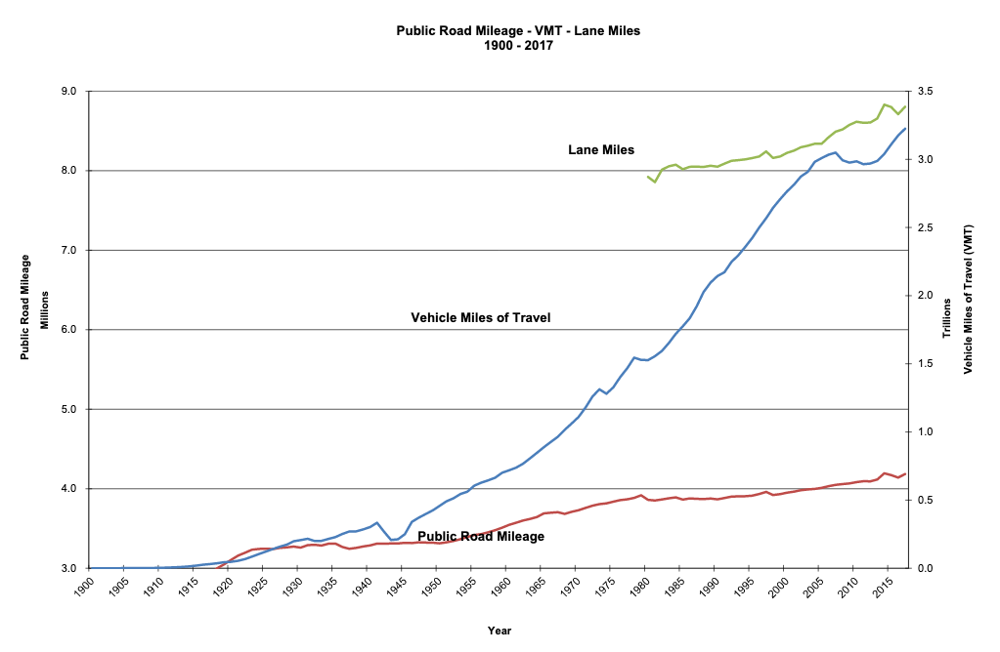

# Pedestrian and Cyclist Safety

Making streets better by understanding the dangers they pose to pedestrians, cyclists and others.

## Motivation

In 2018, Bicycling magazine rated Seattle the countries best city for cyclists.  Denver, the city I live in, dropped three positions to 14.  Cyclist safety is an [issue](https://denverite.com/2019/07/31/traffic-deaths-are-having-a-moment-in-denver-its-the-latest-in-a-scroll-of-preventable-deaths/) here in Denver.  I count my self lucky that I can ride my bike to work.  Yet, with cyclist fatalities in the news, I wondered how do Denver and Seattle compare in terms of cyclist and pedestrian fatalities, and how have those trends changed over time?   This project aims to investigate these questions.

## Goals

1. Analyze the number of fatal traffic accidents per capita, how they have varied over time, and compare the rates in Denver, Colorado and Seattle, Washington.  

1. Investigate the number of pedestrian and bicycle accidents that occur in Denver and Seattle.

## Tech Rational

For this project, I choose to use [PySpark](https://spark.apache.org/docs/latest/api/python/index.html) for ETL processing and [AWS S3](https://aws.amazon.com/s3/) for storing the input and output data.  PySpark allows me to develop on my local machine, possibly using a subset of the data, and then run the same code on [AWS EMR](https://aws.amazon.com/emr/) with minimal changes.  Beyond its ability to easily scale, PySpark offers a host of data sources (SQL, CSV, JSON, Parquet, ...).  AWS S3 provides economical storage, AWS services are built to integrate with it easily, and is easily accessible.  

## Scenarios

1. **100x the amount of data** - I would continue to PySpark and use a subset of the data for development and testing, and only run the full data set once I had deployed the code to AWS EMR.  While continuing to store the data on AWS S3, I would experiment with using Parquet as a file storage format.  Its columnar access and fast read and write performance would shorten runtimes significantly.

1. **Pipeline needs to be run daily at 7 AM** - An orchestration tool, like [Apache Airflow](https://airflow.apache.org/), that can run tasks on schedule is the change I would make in this scenario.  Orchestration evolving category, I would evaluate several before making a decision.

1. **100 people need to access the database** - Clearly, this scenario requires an enterprise-level database.  [AWS Redshift](https://aws.amazon.com/redshift/) would be one possibility, especially if the users are primarily analysts in need of an Online Analytical Processing system.  Redshift's columnar data reads and writes help to speed analytical workflows.  On the other hand, if transaction processing is the focus of the system, where rows are being processed, then a relational database solution would be the right choice, such as [Amazon Relational Database Service (RDS)](https://aws.amazon.com/rds/).

## Extract, Transform and Load Pipeline Steps

The pipeline code performs the following steps:

1. Read in the environment variable that defines where data are stored.

1. Determine if the user is running locally or on AWS.  Currently, only the local option is working.

1. Loop over directories holding the annual sets of FARS data.  The goal is to allow Spark to make _narrow_ transformations that are optimally run in parallel.  I intend to replace the for-loop with a call to `reduce`.  Hence, the `TODO` comment signally my intention.

1. For each directory, join the accident.csv file to the acc_aux.csv file.  The acc_aux.csv contains consistently coded data, whereas the meaning of codes in the accident file has changed over the years.  So, I select a minimal set of columns from the accident table, and a maximal set from the acc_aux table.

1. Extra spaces in the column names found in a few CSV files cause problems during development.  A call to `fix_spaces_in_column_names()` removes them.  

1. Joining the accident and acc_aux tables using the ST_CASE column combines the dataframes.  Data elements in these two tables are a one-to-one match, so I use an inner (default) join.

1. The accident table has changed over the years.  Inconsistent column names caused the pipeline to crash.  Putting this error-prone step in a try / except block, where I find the set of common columns.

1. Combining the dataframes using reduce into one using shared column names: `all_acc_df = reduce(DataFrame.unionByName, acc_dfs)`.

1. Writing the `all_acc_df` dataframe to disk as a partitioned CSV file, so that it is ready for analysis.  Having many files allows Spark to perform this step in parallel, improving runtimes and enabling the workflow to scale.

## Requirements

1. Analyze over 1,000,000 rows of data.  Here I ingest 1,349,445 rows of [FARS](https://www.nhtsa.gov/research-data/fatality-analysis-reporting-system-fars) data spanning a 36 year period.  Every row represents a fatal motor vehicle accident.  

```python
# read in accident data
    full_path = str(
        utils.get_interim_data_path() / "all_accidents_1982_to_2018.csv"
    )
    accidents = utils.read_csv(full_path)

    # convert column to integer
    accidents = accidents.withColumn(
        "FATALS", accidents["FATALS"].cast(T.IntegerType())
    )

    # prepare for analysis
    accidents.createOrReplaceTempView("accidents")

    # total number of accidents
    print(f"\nFatal Accidents 1982 to 1018: {accidents.count():,}")
    # Fatal Accidents 1982 to 1018: 1,349,445
```

2. Provide a [data dictionary](./data-dictionary.md) for the project.

3. Use at least two data "flavors".  FARS data relies on Geographic Location Codes ([FRPP GLC](https://www.gsa.gov/reference/geographic-locator-codes/glcs-for-the-us-and-us-territories)) to identify the state, , and city where the accident occurred.  The General Services Administration provides these data as Excel files.  To meet the requirements of this project, I converted the spreadsheet to CSV, then converted the [CSV to JSON](https://csvjson.com/csv2json), and used the JSON in my analysis.  

    ```python
    # read in geographic location codes as json
    glc_path = str(
        utils.get_external_data_path(
            src_dir="FRPP_GLC", filename="FRPP_GLC_United_States.json"
        )
    )

    location = spark.read.json(
        glc_path, mode="FAILFAST", multiLine=True, allowNumericLeadingZero=True
    )
    location.show(5)
    # +---------+--------------+------------+-----------+-----------+-----------------+-------------+----------+----------+---------+
    # |City_Code|     City_Name|Country_Code|County_Code|County_Name|Date_Record_Added|Old_City_Name|State_Code|State_Name|Territory|
    # +---------+--------------+------------+-----------+-----------+-----------------+-------------+----------+----------+---------+
    # |     0010|     ABBEVILLE|         840|        067|      HENRY|                 |             |        01|   ALABAMA|        U|
    # |     0050|   ALBERTVILLE|         840|        095|   MARSHALL|                 |             |        01|   ALABAMA|        U|
    # |     0060|ALEXANDER CITY|         840|        123| TALLAPOOSA|                 |             |        01|   ALABAMA|        U|
    # |     0070|    ALICEVILLE|         840|        107|    PICKENS|                 |             |        01|   ALABAMA|        U|
    # |     0090|     ANDALUSIA|         840|        039|  COVINGTON|                 |             |        01|   ALABAMA|        U|
    # +---------+--------------+------------+-----------+-----------+-----------------+-------------+----------+----------+---------+
    # only showing top 5 rows
    ```

4. Have at least data quality checks.  

    Three data quality checks are in [`etl.py`](./etl.py) that assert every dataframe 1 or more rows.  

    ```python
    # data quality check #3
    assert (
        all_acc_df.count() > 0
    ), "Combined accident and acc_aux table (all_acc_df) dataframe is empty!"
    ```

## Pedestrian and cyclist fatalities in Denver, CO and Seattle, WA

Here is the SQL query I used to create the table of preliminary results and the [PySpark](https://spark.apache.org/docs/latest/api/python/index.html#)  code to save them as a set of CSV files.  

```python
    # now just pedestrian and bicycle accidents
    ped_bike_fatalities = spark.sql(
        """
        SELECT a.YEAR as Year, l.City_Name, sum(a.FATALS) as Ped_Bike_Fatalities
        FROM accidents a
        JOIN location l
        ON (a.STATE = l.State_Code AND
        a.COUNTY = l.County_Code AND
        a.CITY = l.City_Code)
        WHERE ((l.State_Code = '08' AND l.City_Code = '0600') OR
        (l.State_Code = '53' AND l.City_Code = '1960')) AND
        (a.A_PED = 1 OR a.A_PEDAL = 1)
        GROUP BY a.YEAR, l.City_Name
        ORDER BY a.YEAR
        """
    )
    ped_bike_fatalities.show(5)
    # +----+---------+-----------+
    # |YEAR|City_Name|sum(FATALS)|
    # +----+---------+-----------+
    # |1982|  SEATTLE|         17|
    # |1982|   DENVER|         24|
    # |1983|  SEATTLE|         20|
    # |1983|   DENVER|         13|
    # |1984|  SEATTLE|         16|
    # +----+---------+-----------+
    # only showing top 5 rows

    # save the results
    ped_bike_fatalities_path = str(
        utils.get_interim_data_path() / "ped_bike_fatalities.csv"
    )
    utils.write_csv(ped_bike_fatalities, ped_bike_fatalities_path)
```

## Running

1. Perform ETL by running `python etl.py` from the project directory.

2. Analyze the data by running `python analysis.py`.

## Access to Data

The data for this project are in the traffic-safety bucket on AWS S3 located in the `us-west-2` data center.  There are two ways to access this data:

1. Browsing to `http://traffic-safety.s3-us-west-2.amazonaws.com/`.  Currently, only raw XML is displayed.  Hopefully, I will be able to improve that soon.  

1. Using the AWS Command Line Interface by installing `conda install -c conda-forge awscli`.  Configuring your settings if need be, and then, running `aws s3 ls traffic-safety --recursive`.  

## Data Sources

To meet these goals, I am relying on the follow data sets.

* [Fatality Analysis Reporting System (FARS)](https://www.nhtsa.gov/research-data/fatality-analysis-reporting-system-fars) - A nationwide census of fatal motor vehicle accidents compiled by the National Highway Traffic Safety Administration (NHTSA) with data provided by the states.  You can find the documentation [here](https://crashstats.nhtsa.dot.gov/#/DocumentTypeList/23) and three reports, in particular, were especially important for my analysis:

  * [Fatality Analysis Reporting System \(FARS\)  Analytical User’s Manual, 1975-2018 \(NHTSA\)](https://  crashstats.nhtsa.dot.gov/Api/Public/ViewPublication/812827)
  
  * [Fatality Analysis Reporting System (FARS) Auxiliary Datasets Analytical User’s Manual 1982-2018   (NHTSA)](https://crashstats.nhtsa.dot.gov/Api/Public/ViewPublication/812829)
  
  * [2018 FARS/CRSS Pedestrian Bicyclist Crash, Typing Manual, A Guide for Coders Using the FARS/CRSS Ped/  Bike Typing Tool Revision Date: June 2019 (NHTSA)](https://crashstats.nhtsa.dot.gov/Api/Public/  ViewPublication/812809)
  
   - The relations between the FARS   data files, type of data they represent, and how to the data elements that used to join them.  
  
* [GLCs for the U.S. and U.S. Territories](https://www.gsa.gov/reference/geographic-locator-codes/  glcs-for-the-us-and-us-territories) - Source of Geographic Location Codes provided by the U.S. General   Services Administration.  

## Files

* [etl.py](./etl.py) - Extracts, transforms and loads the traffic accident data.

* [analysis.py](./analysis.py) - Analysis of pedestrian and cyclist fatalities from 1982 to 2018.

* [utils.py](./utils.py) - A module of functions to start spark sessions, read and write data, and find data directory paths.

* [data-dictionary.md](./data-dictionary.md) - The data dictionary for this project.

* [BoundingBox](https://boundingbox.klokantech.com/) - Interactively define the latitude and longitude coordinates of a bounding box and export them to various formats.  

  

* [New York Times - A Few Cities Have Cornered Innovation Jobs. Can That Be Changed?](https://www.nytimes.com/2019/12/09/business/economy/innovation-jobs-cities.html) - Which US cities have gained and lost jobs in the "software and pharmaceuticals, semiconductors and data processing" sectors.  

  * Gainers: San Francisco, CA; Seattle, \"Silicon Valley\", CA; WA; Boston, MA; San Diego, CA; Raleigh, NC; Madison, WI; Denver, CO; Salt Lake City, UT; Charleston, SC.

  * Losers: Oxnard, CA; Albuquerque, NM; Colorado Springs, CO; Durham, NC; Washington, DC; Wichita, KA; Los Angeles, CA; Dallas, TX; Philadelphia, PA; Chicago, IL.

  

## Citations

* [The Best Bike Cities in America (2018)](https://www.bicycling.com/culture/a23676188/best-bike-cities-2018/) - Rates and compares American cities in terms of their Bike safety, friendliness, energy, and culture. Seattle is #1, having risen from #6 in 2017, while Denver has dropped three places to #14.

* [Traffic deaths are having a moment in Denver. It’s the latest in a series of preventable deaths](https://denverite.com/2019/07/31/traffic-deaths-are-having-a-moment-in-denver-its-the-latest-in-a-scroll-of-preventable-deaths/)

* [Cycling lanes reduce fatalities for all road users, study shows](https://www.sciencedaily.com/releases/2019/05/190529113036.htm) - A comprehensive 13-year study of 12 cities looked at factors affecting cyclist safety and finds that protected bikes lanes are the most effective at reducing fatalities.

* [Road Mileage - VMT - Lane Miles, 1900 - 2017 (FHWA)](https://www.fhwa.dot.gov/policyinformation/statistics/2017/pdf/vmt421c.pdf) - Vehicle miles traveled are snowballing in the US.  The growth in the milage of roads is modest by comparison.



* [Cookiecutter Data Science](https://drivendata.github.io/cookiecutter-data-science/) - Adopting the data organization scheme from this standardized approach to data science projects.

* [CSV to JSON - Online tool to convert your CSV or TSV formatted data to JSON.](https://csvjson.com/csv2json) - Converted FRPP_GLC data set from CSV to JSON.
